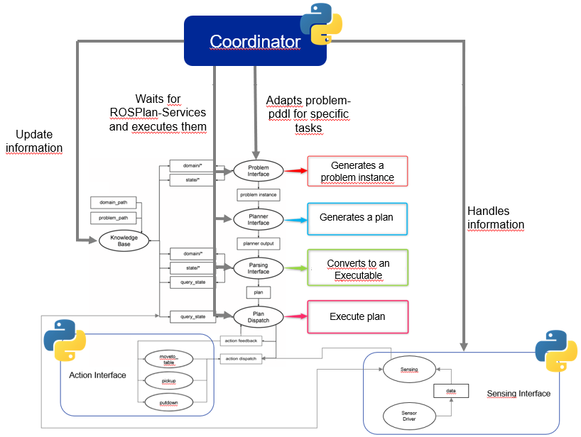

# Planning with ROSPlan

## About the project
Building a simulation environment reflecting the following scenario:
- Gazebo world incl. robot, 2 rooms. 
- In the initial state, the robot is in room A and each table in room A has 2 drinks. 
- The goal is for the robot to check all tables in room B and ensure that each table within room B has 2 drinks.

### High-level architecture

## Documentation
Located at `~/rosplan_ws/src/asap/DOKU/Präsentation.pptx`
## Getting started
To get the project up and running, follow the instructions below.

### Prerequisites
- This project was developed and tested on Ubuntu 18.04 with ROS Melodic in WSL, hence this is the recommended setup.
- Follow the instructions on the following links to install the following prerequisites:
    - [WSL](https://docs.microsoft.com/en-us/windows/wsl/install-win10)
    - [ROS Melodic](http://wiki.ros.org/melodic/Installation/Ubuntu)

### Installation
- Create a directory for the project:
```bash
mkdir ~/rosplan_ws
cd ~/rosplan_ws
```
- Clone this repository:
```bash
git clone https://TODO .
```
- Install ROSPlan and its dependencies:
```bash
cd ~/rosplan_ws/src
git clone https://github.com/clearpathrobotics/occupancy_grid_utils
git clone https://github.com/KCL-Planning/rosplan.git
git clone https://github.com/KCL-Planning/rosplan_demos.git
```
- Compile the project:
```bash
cd ~/rosplan_ws
catkin build
```
- Source the project workspace:
```bash
source ~/rosplan_ws/devel/setup.bash
```
- Export turtlebot3 configuration:
```bash
export TURTLEBOT3_MODEL=waffle
```

### Running the project
- Launch the project:
```bash
roslaunch asap start_project.launch
```
- For launching the project in 'explore only' mode:

First uncomment row 245 from main_executor.py and set it to False:
```python
main_task = False
```
Now start the project:
```bash
roslaunch asap start_project.launch
```
- For launching the project in 'serve only' mode

First uncomment row 245 from main_executor.py and set it to True:
```python
main_task = True
```
Now start the project:
```bash
roslaunch asap start_project.launch
```
## Troubleshooting
- If you encounter errors with the base ROSPlan sensing interface when retrieving predicates, try the following:
    - Open the file `~/rosplan_ws/src/rosplan/rosplan_sensing_interface/scripts/sensing_interface.py`
    - Change line 155 to the following:
```python
instances = self.get_instances_srv.call(GetInstanceServiceRequest(p.value, True, True)).instances
```
- If you encounter errors with the base ROSPlan unable to change KB INEQUALITY Items e.g. 

    ```(= (n_drinks tableb1) 2)```

    try the following:
    - Open the file `~/rosplan_ws/src/rosplan/rosplan_knowledge_base/src/KnowledgeComparitor.cpp`
    - go to Line 165.
    - Change the code from 
    ```cpp
		case rosplan_knowledge_msgs::KnowledgeItem::INEQUALITY:
			{
				return true;
			}
			break;
    ```
    to
    ```cpp
		case rosplan_knowledge_msgs::KnowledgeItem::INEQUALITY:
			{
				// check instance knowledge
				if(!boost::iequals(a.instance_name, b.instance_name)) return false;

				// negative fact
				if(a.is_negative != b.is_negative) return false;

				return true;
			}
			break;
    ```
    Now ROSPlan should be able to distinguish multiple KB INEQUALITY Items.
## Authors
- Ozan Anli (oanli@stud.hs-heilbronn.de)
- Rico Steinke (rsteinke@stud.hs-heilbronn.de)